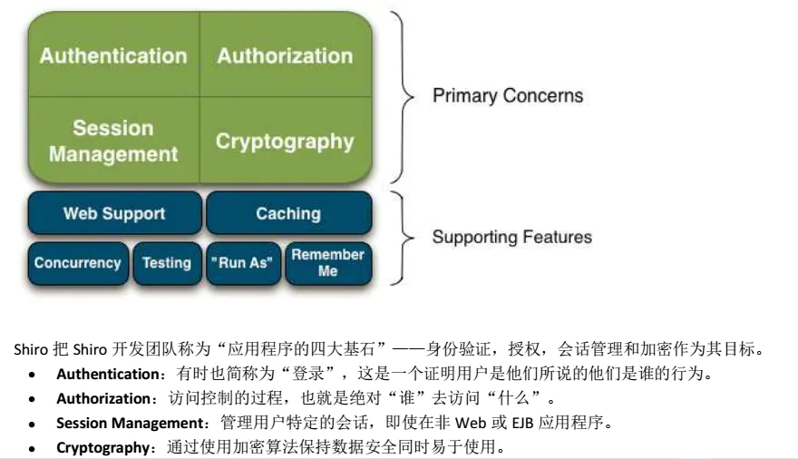
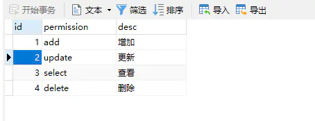
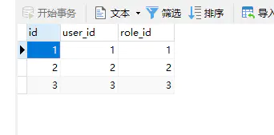
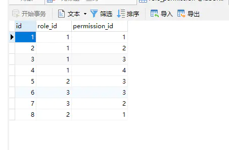
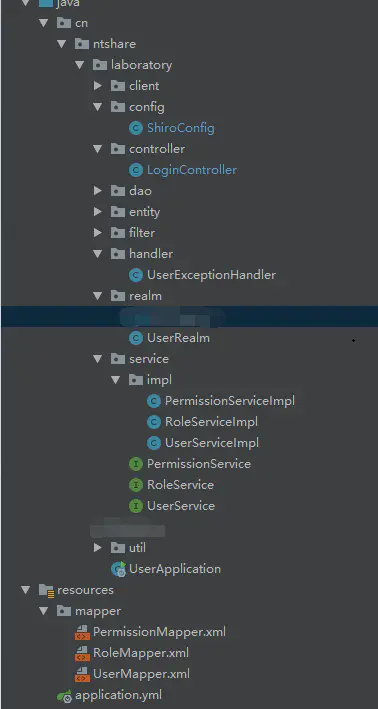

**Spring Boot 极简集成 Shiro**

    1.前言
    Apache Shiro是一个功能强大且易于使用的Java安全框架，提供了认证，授权，加密，和会话管理。
    

    Shiro有三大核心组件：
        Subject：即当前用户，在权限管理的应用程序里往往需要知道谁能够操作什么，谁拥有操作该程序的权利，
                shiro中则需要通过Subject来提供基础的当前用户信息，Subject 不仅仅代表某个用户，与当前应用交互的任何东西都是Subject，如网络爬虫等。
                所有的Subject都要绑定到SecurityManager上，与Subject的交互实际上是被转换为与SecurityManager的交互。
        
        SecurityManager：即所有Subject的管理者，这是Shiro框架的核心组件，可以把他看做是一个Shiro框架的全局管理组件，
                        用于调度各种Shiro框架的服务。作用类似于SpringMVC中的DispatcherServlet，用于拦截所有请求并进行处理。
        

        Realm：Realm是用户的信息认证器和用户的权限人证器，我们需要自己来实现Realm来自定义的管理我们自己系统内部的权限规则。
              SecurityManager要验证用户，需要从Realm中获取用户。可以把Realm看做是数据源。

    
    
    2. 数据库设计
                -- User(用户)
                

                DROP TABLE IF EXISTS `user`;
                CREATE TABLE `user`  (
                `id` bigint(20) NOT NULL AUTO_INCREMENT,
                `password` varchar(255) CHARACTER SET utf8 COLLATE utf8_general_ci NULL DEFAULT NULL,
                `username` varchar(255) CHARACTER SET utf8 COLLATE utf8_general_ci NULL DEFAULT NULL,
                `account` varchar(255) CHARACTER SET utf8 COLLATE utf8_general_ci NULL DEFAULT NULL,
                PRIMARY KEY (`id`) USING BTREE
                
                ) ENGINE=InnoDB DEFAULT CHARSET=utf8mb4 COMMENT='用户表';
                
                
                INSERT INTO `user` VALUES (1, 'root', '超级用户', 'root');
                INSERT INTO `user` VALUES (2, 'user', '普通用户', 'user');
                INSERT INTO `user` VALUES (3, 'vip', 'VIP用户', 'vip');
                
                --  Role(角色)
                
                DROP TABLE IF EXISTS `role`;
                CREATE TABLE `role`  (
                `id` int(11) NOT NULL AUTO_INCREMENT,
                `role` varchar(255) CHARACTER SET utf8 COLLATE utf8_general_ci NULL DEFAULT NULL,
                `desc` varchar(255) CHARACTER SET utf8 COLLATE utf8_general_ci NULL DEFAULT NULL,
                PRIMARY KEY (`id`) USING BTREE
                ) ENGINE=InnoDB DEFAULT CHARSET=utf8mb4 COMMENT='角色表';
                
                INSERT INTO `role` VALUES (1, 'admin', '超级管理员');
                INSERT INTO `role` VALUES (2, 'user', '普通用户');
                INSERT INTO `role` VALUES (3, 'vip_user', 'VIP用户');
                
                
                -- Permission(权限)
                
                DROP TABLE IF EXISTS `permission`;
                CREATE TABLE `permission`  (
                `id` int(11) NOT NULL AUTO_INCREMENT,
                `permission` varchar(255) CHARACTER SET utf8 COLLATE utf8_general_ci NULL DEFAULT NULL COMMENT '权限名称',
                `desc` varchar(255) CHARACTER SET utf8 COLLATE utf8_general_ci NULL DEFAULT NULL COMMENT '权限描述',
                PRIMARY KEY (`id`) USING BTREE
                ) ENGINE=InnoDB DEFAULT CHARSET=utf8mb4 COMMENT='权限表';
                
                INSERT INTO `permission` VALUES (1, 'add', '增加');
                INSERT INTO `permission` VALUES (2, 'update', '更新');
                INSERT INTO `permission` VALUES (3, 'select', '查看');
                INSERT INTO `permission` VALUES (4, 'delete', '删除');

                
                -- User_Role(用户-角色)
                
                DROP TABLE IF EXISTS `user_role`;
                CREATE TABLE `user_role`  (
                `id` int(11) NOT NULL AUTO_INCREMENT,
                `user_id` int(11) NULL DEFAULT NULL,
                `role_id` int(11) NULL DEFAULT NULL,
                PRIMARY KEY (`id`) USING BTREE
                ) ENGINE=InnoDB DEFAULT CHARSET=utf8mb4 COMMENT='用户-角色关联表';
                
                INSERT INTO `user_role` VALUES (1, 1, 1);
                INSERT INTO `user_role` VALUES (2, 2, 2);
                INSERT INTO `user_role` VALUES (3, 3, 3);
                
                
                -- Role_Permission(角色-权限)
                
                DROP TABLE IF EXISTS `role_permission`;
                CREATE TABLE `role_permission`  (
                `id` int(11) NOT NULL AUTO_INCREMENT,
                `role_id` int(11) NULL DEFAULT NULL,
                `permission_id` int(255) NULL DEFAULT NULL,
                PRIMARY KEY (`id`) USING BTREE
                ) ENGINE=InnoDB DEFAULT CHARSET=utf8mb4 COMMENT='角色-权限关联表';
                
                INSERT INTO `role_permission` VALUES (1, 1, 1);
                INSERT INTO `role_permission` VALUES (2, 1, 2);
                INSERT INTO `role_permission` VALUES (3, 1, 3);
                INSERT INTO `role_permission` VALUES (4, 1, 4);
                INSERT INTO `role_permission` VALUES (5, 2, 3);
                INSERT INTO `role_permission` VALUES (6, 3, 3);
                INSERT INTO `role_permission` VALUES (7, 3, 2);
                INSERT INTO `role_permission` VALUES (8, 2, 1);

    3. 项目结构
            
    
        
        
        

        
        

    
    

